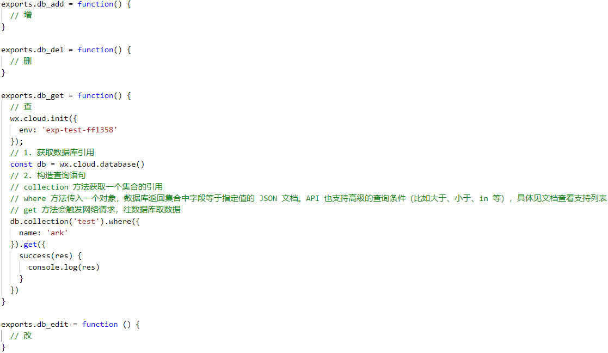
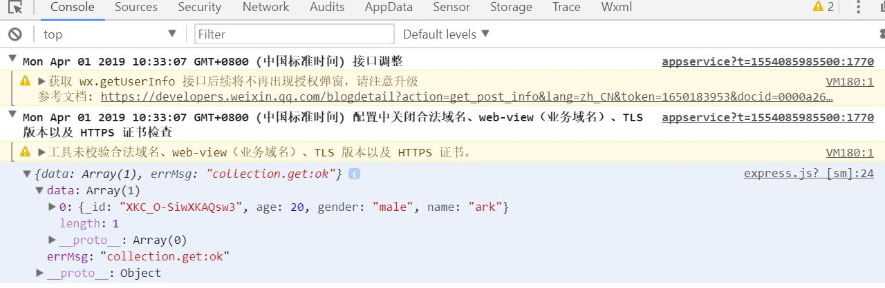

# 第二周任务

## 学会使用云数据库，添加collection，写增、删、查、改四个云函数

1. [增加一个collection](https://developers.weixin.qq.com/miniprogram/dev/wxcloud/guide/database/getting-started.html)
2. 添加一个叫api的文件夹，其下添加一个js，名字随便取


1. 查看[微信官方文档](https://developers.weixin.qq.com/miniprogram/dev/wxcloud/guide/)和自己百度，参考下图在js中写**增删查改**函数，其中查是我写的示例



1. 找到首页的js（就是一进来那个页面，例如home/home.js），在开头添加一行
   ```js
   // 单引号里面的是你写的js的路径
   // 相当于#include
   const test = require('../../api/express')
   ```
2. 找到onLoad函数，在第一行添加
   ```js
   test.db_add();
   test.db_del();
   test.db_get();
   test.db_edit();
    ```
3. 保存编译，查看控制台的信息，以下是示例结果

