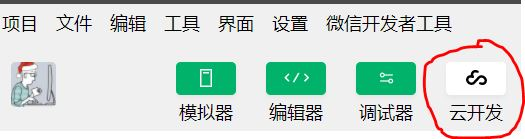
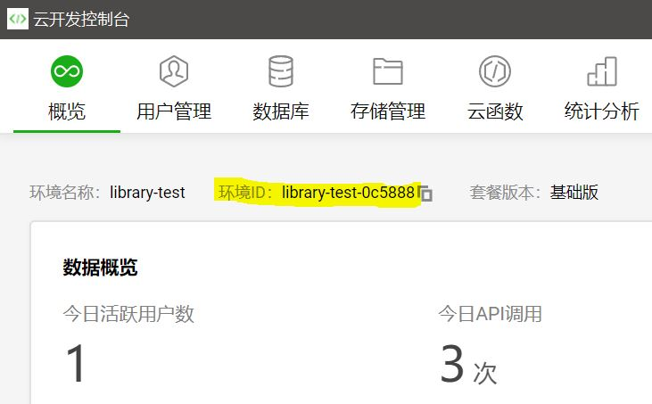
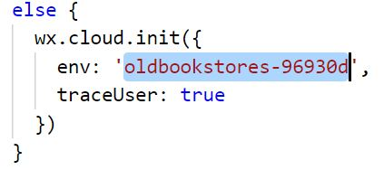
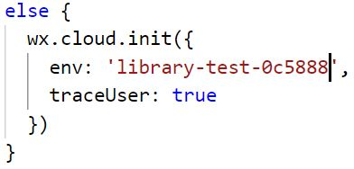
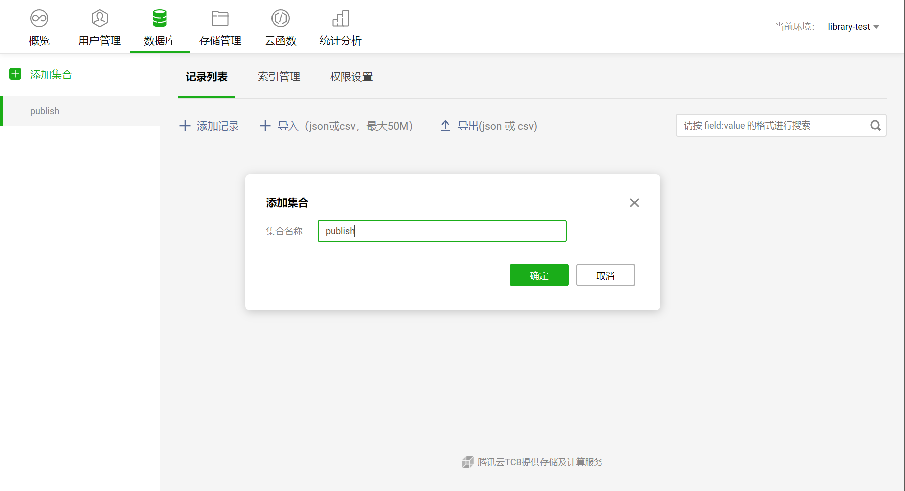

# 使用说明

1. 克隆代码
    ``` bash
    cd "your path" # cd到你要放的目录
    git clone https://github.com/anxunsi/TIC-Library.git # 使用cygwin或者git bash
    ```
	
	**如果小程序运行正常，请忽略下面几点**
2. 用微信开发助手打开项目
3. 点击云开发

   

   如果没有申请云开发，申请
4. 创建一个环境，复制一下环境ID
   
   
5. 修改app.js里的env为自己的环境ID
   
   

   
6. 在云开发里创建四个叫"publish", "sell", "buy", "userInfo"的collection
   
   
   
**注意**如果控制台提示"wx-server-sdk"找不到，请cd到cloudfunctions，分别cd到login和update文件夹下，查看有无"node_modules"文件夹，如果有直接跳下一步上传，否则输入```npm uninstall --save wx-server-sdk@latest```(需要安装node.js和npm，请自行百度)，然后在开发者工具两个文件夹右键-"上传所有文件"。