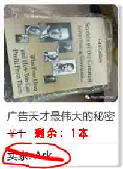
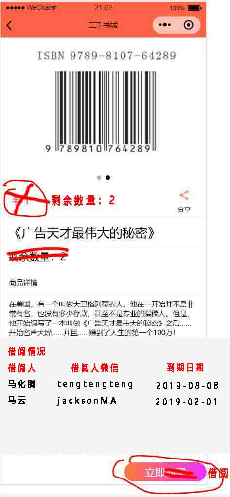
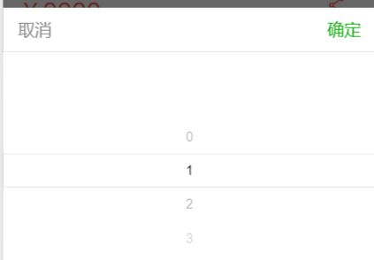
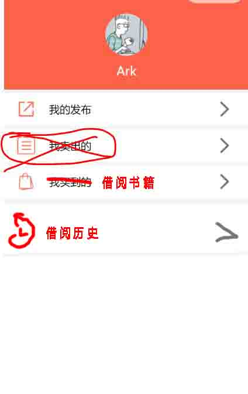
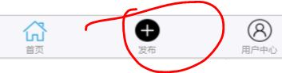
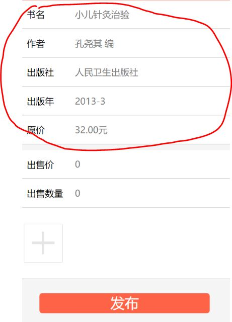
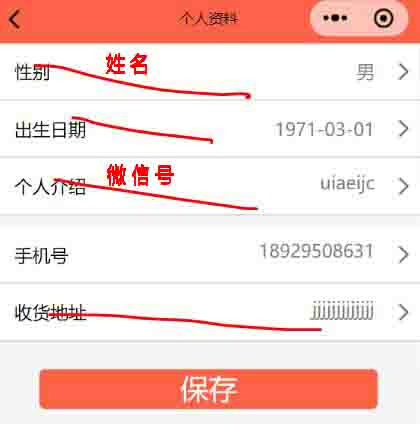

## 修改方案

1. 图书属性：删除价格、卖家，增加借阅者信息（姓名、微信号）借阅剩余天数；
2. 由于同一本书库存可能不止一本，借阅者信息、借阅天数是一个列表；
3. “立即购买”改为“立即借阅”，书被借完时（剩余数量0）无法点击，点击借阅（不用选择多少本）借阅后修改借阅者、剩余天数；

4. 在“用户中心”中，“我卖出的”删除，“我买到的”改为“我的借阅”；
5. 点击图书进入书籍详情页，详情页增加“修改”、“删除”，如果是书的主人可见修改删除按钮，在“我发布的”、“我的借阅”中点击书籍也可以跳到详情页；

6. 发布书籍按钮可以放到“用户中心”里；

1. “发布书籍”页，扫码获取信息后信息改为可编辑，增加“标签”；

8. “个人资料”页只保留手机号，增加微信号、姓名（默认为微信nickname）

9.  （可选）对非我社团的用户，不显示书籍。方法1：设置社团密码，输入才能使用小程序；方法2：个人信息处增加校园卡号，由后台审核后手动赋予权限（用户增加一个权限属性）。

----------请大家补充修改----------